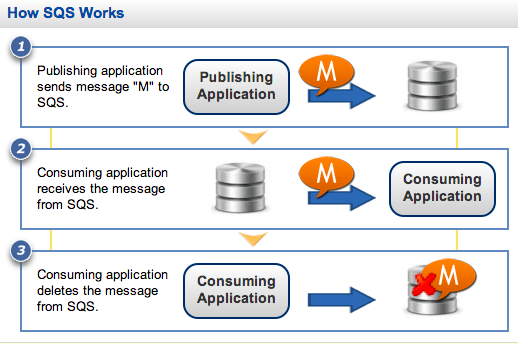
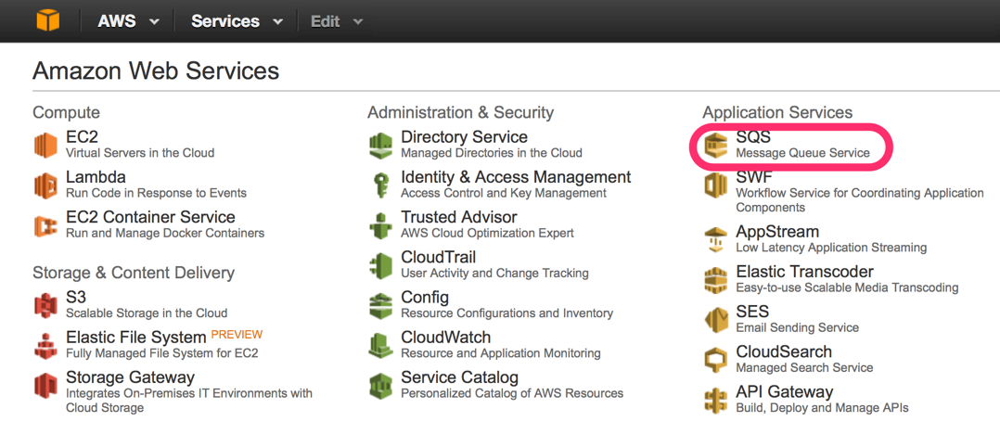
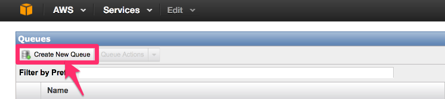
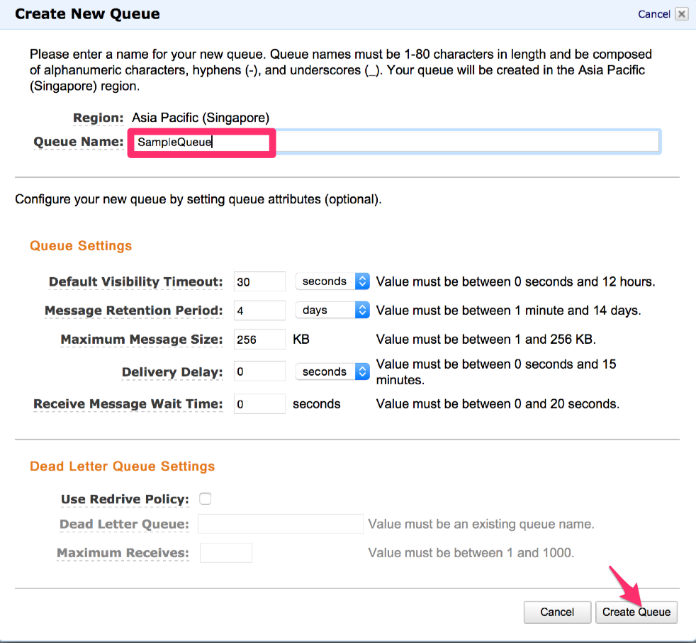
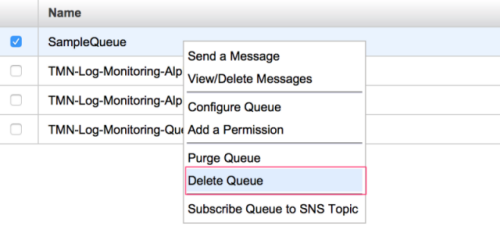

#How to use Amazon SQS
  
( Source : http://aws.amazon.com/sqs/getting-started/)

   

##Create New Queue
1. From home console go to SQS application service

	

2. Click create new queue

	
	
3. Enter a name for your new queue ex. "SampleQueue" and click <kbd>Create Queue</kbd>
	
	
	
	
	
##Delete Queue
(Source : http://docs.aws.amazon.com/AWSSimpleQueueService/latest/APIReference/API_DeleteQueue.html)

1. Select the Queue you want to delete, right-click on that and click delete.

	