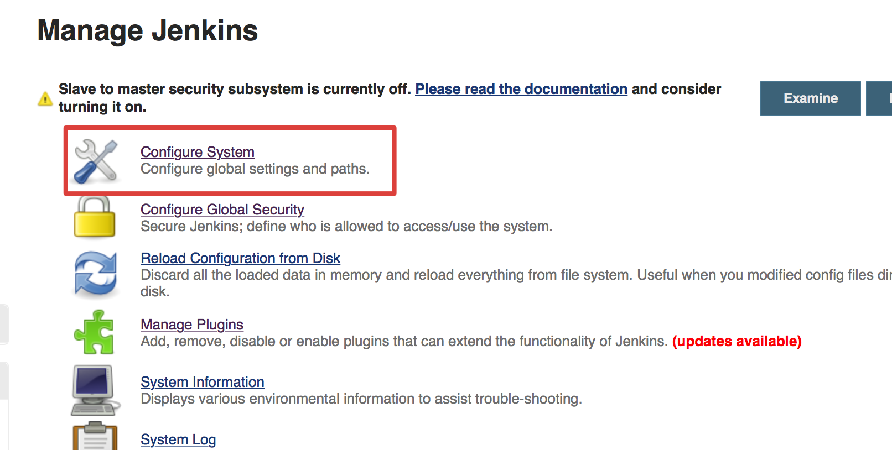
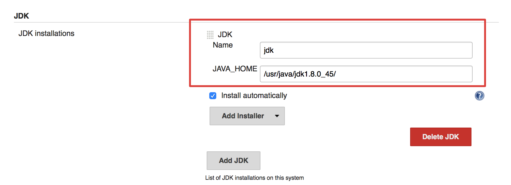

#Jenkins Installation for CentOS

  
( Source : http://sanketdangi.com/post/62715793234/install-configure-jenkins-on-amazon-linux )

##Prerequisite
  * Security port 8080 enabled (หรือ port ที่ต้องการ)
  * Linux OS
  * Oracle JDK
  
  ##Installation steps
1.  Launch and login to Amazon instance  

2.  Become a root using <code>sudo su -</code> command.

3.  Update your repositories using  

        yum update

4.  Install <code>wget</code> using  

        yum install wget
        
5.	Add the Jenkins repository to the yum repos, and install Jenkins from here.

		sudo wget -O /etc/yum.repos.d/jenkins.repo http://pkg.jenkins-ci.org/redhat-stable/jenkins.repo
		
6.	Get jenkins repository key

		sudo rpm --import https://jenkins-ci.org/redhat/jenkins-ci.org.key
		
7. 	Install jenkins package

		sudo yum install 
		
8.  Start jenkins using  

        service start jenkins
        
9.  Open your browser and navigate to <code>http://< your-jenkins-ip >:8080</code>. You'll see jenkins dashboard.

10. Next, you'll need to locate the JDK for Jenkins, please select `Manage Jenkins` 

11. On jenkins dashboard and click on `Configure System`.

12. Scroll down to `JDK` section, Click <kbd>Add JDK</kbd> and fill in the following path. Then, click <kbd>Save</kbd>.

